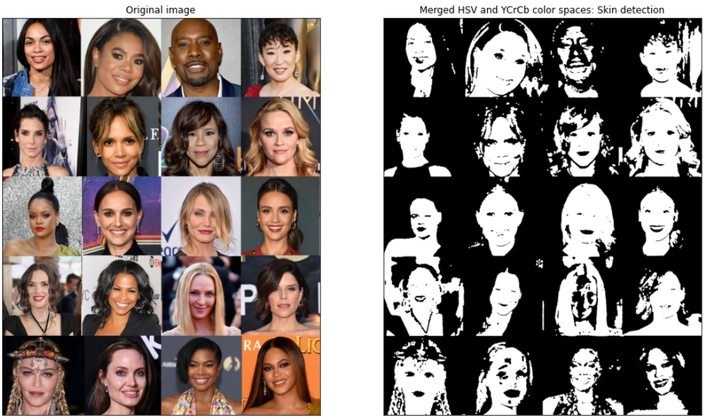

# Human Skin Detection via Color Space Segmentation inPython

## 1. Objective

The objective of his project is to implement and demonstrate how to reliably detect human skin using color space segmentation.

## 2. Skin Detection

Skin detection is the process of finding skin-colored pixels and regions in an image or a video. This process is typically used as a preprocessing step to find regions that potentially have human faces and limbs in images.  The primary key for skin recognition from an image is the skin color. But color cannot be the only deciding factor due to the variation in skin tone according to different races. Other factors such as the light conditions also affect the results. Therefore, the skin tone is often combined with other cues like texture and edge features. This is achieved by breaking down the image into individual pixels and classifying them into skin colored and non-skin colored. One simple method is to check if each skin pixel falls into a defined color range or values in some coordinates of a color space.  The selection of the color range threshold values depends on several factors, including:

  * Illumination conditions
  * Individual characteristics such as age, sex and body parts.
  * Varying skin tone with respect to different races. 
  * Other factors such as background colors, shadows and motion blur.

There are many skin color spaces like RGB, HSV, YCbCr, YIQ, YUV, etc. that are used for skin color segmentation. In this project, we implement a threshold based on the combination of HSV and YCbCr color spaces and experiment with different color range threshold values.

## 3. Data

We shall use the following image, which has many people with different ethnicities and skin tones, under good illumination conditions. 

## 4. Development

In this section, we shall walkthrough the development and illustration of the watershed segmentation algorithm using OpenCV built-in functionalities. 

  * Project: Human skin detection based on color segmentation: 
  * The objective of this project is to demonstrate how to detect human skin based on color space segmentation: 
  * This is a pixelwise process, which involves the following steps: 
    1. The RGB image value is converted to HSV color space: 
        * Potential skin pixels are detected based on a simple thresholding operation
        * HSV color space: 0<=H<=17 and 15<=S<=170 and 0<=V<=255 
    2.  The RGB image value is converted to YCrCb color space: 
        * Potential skin pixels are detected based on a simple thresholding operation
        * YCbCr color space: 0<=Y<=255 and 135<=Cr<=180 and 85<=Cb<=135 
    3. The HSV and YCbCr skin segmentations are merged together to obtain a more accurate skin segmentation. 

 We shall implement and illustrate each of these steps below.

* Author: Mohsen Ghazel (mghazel)
* Date: March 29th, 2021

### 4.1. Step 1: Imports and global variables:

#### 4.1.1. Python imports:

<pre style="color:#000020;background:#e6ffff;font-size:10px;line-height:1.5;">#======================================================
# Python imports and environment setup
#======================================================
# opencv
import cv2
# numpy
import numpy as np
# matplotlib
import matplotlib.pyplot as plt
import matplotlib.image as mpimg

# input/output OS
import os 

# date-time to show date and time
import datetime

# to display the figures in the notebook
%matplotlib inline

#------------------------------------------
# Test imports and display package versions
#------------------------------------------
# Testing the OpenCV version
print("OpenCV : ",cv2.__version__)
# Testing the numpy version
print("Numpy : ",np.__version__)

OpenCV :  4.5.1
Numpy :  1.19.2
</pre>

#### 4.1.2. Global variables:

<pre style="color:#000020;background:#e6ffff;font-size:10px;line-height:1.5;">#------------------------------------------------------
# Global variales
#------------------------------------------------------
# The RGB image value is converted to HSV color space
# Potential skin pixels are detected based on a simple 
# thresholding operation:
#
# HSV colorspace: 0&lt;=H&lt;=17 and 15&lt;=S&lt;=170 and 0&lt;=V&lt;=255
#
#------------------------------------------------------
# H-channel thresholds:
#------------------------------------------------------
# The minimum H-value
H_MIN = 0
# The maximum H-value
H_MAX = 17
#------------------------------------------------------
# S-channel thresholds:
#------------------------------------------------------
# The minimum S-value
S_MIN = 15
# The maximum S-value
S_MAX = 170
#------------------------------------------------------
# V-channel thresholds:
#------------------------------------------------------
# The minimum V-value
V_MIN = 0
# The maximum V-value
V_MAX = 255

#------------------------------------------------------
# The RGB image value is converted to YCrCb color space
# Potential skin pixels are detected based on a simple 
# thresholding operation:
#
# YCbCr colorspace: 0&lt;=Y&lt;=255 and 135&lt;=Cr&lt;=180 and 85&lt;=Cb&lt;=135
#
#------------------------------------------------------
# Y-channel thresholds:
#------------------------------------------------------
# The minimum Y-value
Y_MIN = 0
# The maximum Y-value
Y_MAX = 255
#------------------------------------------------------
# -channel thresholds:
#------------------------------------------------------
# The minimum Cr-value
Cr_MIN = 135
# The maximum Cr-value
Cr_MAX = 180
#------------------------------------------------------
# Cb-channel thresholds:
#------------------------------------------------------
# The minimum Cb-value
Cb_MIN = 85
# The maximum V-value
Cb_MAX = 135
</pre>

### 4.2. Step 2: Input data

#### 4.2.1. Read and visualize the input template image

<pre style="color:#000020;background:#e6ffff;font-size:10px;line-height:1.5;">#----------------------------------------------------
# Read the test image:
#----------------------------------------------------
# template test file name
test_img_file_path = "../data/test-images/test-image-001.jpg"
# check if the teste image file exists
if(os.path.exists(test_img_file_path) == 0):
    print('Test image file name DOES NOT EXIST! = ' + template_img_file_path)
# Read the test image 
img = cv2.imread(test_img_file_path, cv2.IMREAD_COLOR)
# create a figure and set its axis
fig_size = (8, 12)
# create the figure 
plt.figure(figsize=fig_size)
# axis off
plt.axis('off')
# display the template image
plt.imshow(cv2.cvtColor(img, cv2.COLOR_BGR2RGB))
# set the title
plt.title('Test image', fontsize = 12)
# show the image
plt.show() 
</pre>

### 4.3. Step 3: Detect Skin based on HSV Color space segmentation:

* The RGB image value is converted to HSV color space: 
    * Potential skin pixels are detected based on a simple thresholding operation
    * HSV color space: 0<=H<=17 and 15<=S<=170 and 0<=V<=255 

<pre style="color:#000020;background:#e6ffff;font-size:10px;line-height:1.5;">#------------------------------------------------------
# 3.1) Convert the input image from BGR to HSV color 
#      space
#------------------------------------------------------
img_HSV = cv2.cvtColor(img, cv2.COLOR_BGR2HSV)

#------------------------------------------------------
# 3.2) Apply the thresholding operations on the HSV color 
#      channels as specified above
#------------------------------------------------------
HSV_mask = cv2.inRange(img_HSV, (H_MIN, S_MIN, V_MIN), (H_MAX, S_MAX, V_MAX)) 

#------------------------------------------------------
# 3.3) Apply morphological operations to remove small 
#      disconnected detections
#------------------------------------------------------
HSV_mask = cv2.morphologyEx(HSV_mask, cv2.MORPH_OPEN, np.ones((3,3), np.uint8))

#------------------------------------------------------
# 3.4) Visualize the potential skin-segemntation based
#      on the HSV color space
#------------------------------------------------------
# create a figure
plt.figure(figsize=(16, 12))
# visualize the original image
plt.subplot(121)
plt.title("Original image", fontsize=12)
plt.xticks([]), plt.yticks([])
plt.imshow(cv2.cvtColor(img, cv2.COLOR_BGR2RGB))
# The HSV skin detection
plt.subplot(122)
plt.title("HSV color space: Skin detection", fontsize=12)
plt.xticks([]), plt.yticks([])
plt.imshow(HSV_mask,  cmap='gray', vmin=0, vmax=255);
</pre>

### 4.4. Step 4: Detect Skin based on YCrCb Color space segmentation:
* The RGB image value is converted to YCrCb color space: 
    * Potential skin pixels are detected based on a simple thresholding operation
    * YCbCr color space: 0<=Y<=255 and 135<=Cr<=180 and 85<=Cb<=135 
    

<pre style="color:#000020;background:#e6ffff;font-size:10px;line-height:1.5;">#------------------------------------------------------
# 4.1) Convert the input image from BGR to YCrCb color 
#      space
#------------------------------------------------------
img_YCrCb = cv2.cvtColor(img, cv2.COLOR_BGR2YCrCb)

#------------------------------------------------------
# 4.2) Apply the thresholding operations on the YCrCb color 
#      channels as specified above
#------------------------------------------------------
YCrCb_mask = cv2.inRange(img_YCrCb, (Y_MIN, Cr_MIN, Cb_MIN), (Y_MAX, Cr_MAX, Cb_MAX)) 

#------------------------------------------------------
# 4.3) Apply morphological operations to remove small 
#      disconnected detections
#------------------------------------------------------
YCrCb_mask = cv2.morphologyEx(YCrCb_mask, cv2.MORPH_OPEN, np.ones((3,3), np.uint8))

#------------------------------------------------------
# 4.4) Visualize the potential skin-segemntation based
#      on the YCrCb color space
#------------------------------------------------------
# create a figure
plt.figure(figsize=(16, 12))
# visualize the original image
plt.subplot(121)
plt.title("Original image", fontsize=12)
plt.xticks([]), plt.yticks([])
plt.imshow(cv2.cvtColor(img, cv2.COLOR_BGR2RGB))
# The HSV skin detection
plt.subplot(122)
plt.title("YCrCb color space: Skin detection", fontsize=12)
plt.xticks([]), plt.yticks([])
plt.imshow(YCrCb_mask,  cmap='gray', vmin=0, vmax=255);
</pre>

#### 4.5. Step 5: Combine the HSV and YCrCb Color space segmentations:

* Combine the HSV and YCrCb skin segmentation masks to obtain a final merged skin segmentation mask:

<pre style="color:#000020;background:#e6ffff;font-size:10px;line-height:1.5;">#------------------------------------------------------
# 5.1) Merge the HSV and YCrCb skin masks together:
#------------------------------------------------------
merged_mask=cv2.bitwise_and(YCrCb_mask,HSV_mask)
#------------------------------------------------------
# 5.2) Post-process the moerged mask to reduce noise
#------------------------------------------------------
merged_mask=cv2.medianBlur(merged_mask,3)
#------------------------------------------------------
# 5.3) Apply morphological operations to remove small 
#      disconnected detections
#------------------------------------------------------
merged_mask = cv2.morphologyEx(merged_mask, cv2.MORPH_OPEN, np.ones((4,4), np.uint8))

#------------------------------------------------------
# 5.4) Visualize the final merged skin detection results
#------------------------------------------------------
# create a figure
plt.figure(figsize=(16, 12))
# visualize the original image
plt.subplot(121)
plt.title("Original image", fontsize=12)
plt.xticks([]), plt.yticks([])
plt.imshow(cv2.cvtColor(img, cv2.COLOR_BGR2RGB))
# The HSV skin detection
plt.subplot(122)
plt.title("Merged HSV and YCrCb color spaces: Skin detection", fontsize=12)
plt.xticks([]), plt.yticks([])
plt.imshow(merged_mask,  cmap='gray', vmin=0, vmax=255);
</pre>

#### 4.6. Step 6: Display a successful execution message

<pre style="color:#000020;background:#e6ffff;font-size:10px;line-height:1.5;"># display a final message
# current time
now = datetime.datetime.now()
# display a message
print('Program executed successfully on: '+ str(now.strftime("%Y-%m-%d %H:%M:%S") + "...Goodbye!\n"))

Program executed successfully on: 2021-04-14 10:32:54...Goodbye!
</pre>

## 5. Analysis

* In view of the final image segmentation results, we make the following observations:
    * The HSV color space appears to be more sensitive to skin tone than the YCrCb color space
    * In some cases the HSV color space seems to under-segment.
    * The YCrCb color space yields consistently good skin segmentation results for the different ethnicities and skin tones
    * In some cases the YCrCb color space seems to over-segment.
    * The combined skin segmentation results appear to be negatively impacted by the HSV segmentation for darker skin tones
    * The YCrCb may be the preferred skin segmentation method as it yields consistently good skin detection results for the different ethnicities and skin tones.

## 6. Future Work

* We proposed to explore the following related issues:
  * To further explore the YCrCb color space skin segmentation
  * To experiment with different combinations of color range thresholds
  * To explore the sensitivity of the YCrCb color space skin segmentation to different factors, including:
    * Illumination conditions
    * Individual characteristics such as age, sex and body parts.
    * Varying skin tone with respect to different races. 
    * Other factors such as background colors, shadows and motion blur.

## 7. References

1. Adrian Rosebrock. Skin Detection: A Step-by-Step Example using Python and OpenCV. https://www.pyimagesearch.com/2014/08/18/skin-detection-step-step-example-using-python-opencv/ 
 2. S. Kolkur, et al. Human Skin Detection Using RGB, HSV and YCbCr Color Models. https://arxiv.org/ftp/arxiv/papers/1708/1708.02694.pdf 
 3. Nalin Chhibber. Skin Detection Using OpenCV Python. https://nalinc.github.io/blog/2018/skin-detection-python-opencv/ 
 4. Kseniia Nikolskaia, et al. Skin Detection Technique Based on HSV Color Model and SLIC Segmentation Method. http://ceur-ws.org/Vol-2281/paper-13.pdf 
 5. Rahul Singh. Skin Detection Using OpenCV in Python. https://www.codespeedy.com/skin-detection-using-opencv-in-python/ 
 6. Linda.com. Skin detection. https://www.lynda.com/Python-tutorials/Skin-detection/601786/660485-4.html
 
 

